 Table of contents

- [Introduction to NausiCAä](#introduction-to-nausica)
  - [Automata](#automata)
  - [Rules](#rules)
  - [Sequences](#sequences)
  - [Neighborhoods](#neighborhoods)
    - [Moore](#moore)
    - [von Neumann](#von-neumann)
    - [Circular](#circular)
  - [Value Kinds](#value-kinds)
    - [Discrete](#discrete)
    - [RGB](#rgb)
    - [RGBA](#rgba)
    - [Continuous](#continuous)
  - [Machine Elvish Language](#machine-elvish-language)
    - [Incantation evaluation](#incantation-evaluation)
    - [Compound codons](#compound-codons)
    - [Variables](#variables)
- [Running NausiCAä](#running-nausicaä)
  - [Prerequisites](#prerequisites)
  - [From Binary](#from-binary)
  - [From Source](#from-source)
- [Using the NausiCAä GUI](#using-the-nausicaä-gui)
  - [Main Window](#main-window)
  - [Info Window](#info-window)
  - [Basic Parameters Window](#basic-parameters-window)
  - [Rule Editor Window](#rule-editor-window)
  - [Palette Editor Window](#palette-editor-window)
  - [Automata Menu](#automata-menu)
    - [Setting initial state](#Setting-initial-state)
        * Random:
        * Fixed:
    - [Update Mode](#update-mode)
    - [Edge Mode](#edge-mode)
    - [External Force](#external-force)
  - [Animation Menu](#animation-menu)
    - [Generate to disk](#generate-to-disk)
  - [Mutate Menu](#mutate-menu)
    - [Sequences, Stages, and Mutations](#sequences-stages-and-mutations)
  - [Render Menu](#render-menu)
    - [Composition Mode](#composition-mode)
  - [Cheat Sheet: A Few Important Commands](#a-few-important-commands)
- [Using NausiCAä as a library](#using-nausicaä-as-a-library)
- [Reference Guide](#reference-guide)
  - [Codon Catalog](#codon-catalog)
    - [a (Constant)](#a-constant)
    - [ba (Bitwise Left Rotate)](#ba-bitwise-left-rotate)
    - [be (Greater Than)](#be-greater-than)
    - [bo (Negate)](#bo-negate)
    - [bu (Less Than)](#bu-less-than)
    - [chi (Min)](#chi-min)
    - [cho (Bandpass)](#cho-bandpass)
    - [da (Data Block)](#da-data-block)
    - [de (Hyperpolic Tangent)](#de-hyperpolic-tangent)
    - [do (Duplicate)](#do-duplicate)
    - [e (Avg N)](#e-avg-n)
    - [ga (Halt)](#ga-halt)
    - [ge (Push All Rotate)](#ge-push-all-rotate)
    - [gi (Avg)](#gi-avg)
    - [go (Push All)](#go-push-all)
    - [gu (Count **DEPRECATED - BROKEN - Use `pu` instead**)](#gu-count-deprecated---broken---use-pu-instead)
    - [ha (Exclamatory)](#ha-exclamatory)
    - [he (Convolve)](#he-convolve)
    - [hi (Histogram)](#hi-histogram)
    - [ho (Divide)](#ho-divide)
    - [hu (Supersymmetry)](#hu-supersymmetry)
    - [i (Pow)](#i-pow)
    - [ja (Jump)](#ja-jump)
    - [ji (Skip N)](#ji-skip-n)
    - [jo (Min N)](#jo-min-n)
    - [jya (Relative Coordinate)](#jya-relative-coordinate)
    - [ka (Bitwise Or)](#ka-bitwise-or)
    - [ke (Greater)](#ke-greater)
    - [ki (Push Surrounding)](#ki-push-surrounding)
    - [ko (Bitwise Rotate Left)](#ko-bitwise-rotate-left)
    - [ku (Bitwise Rotate Right)](#ku-bitwise-rotate-right)
    - [kya (Coordinate)](#kya-coordinate)
    - [ma (Equals)](#ma-equals)
    - [me (Sum N)](#me-sum-n)
    - [mi (Sum)](#mi-sum)
    - [mo (Modulo)](#mo-modulo)
    - [mu (Multiply)](#mu-multiply)
    - [mya (Mandelbulb)](#mya-mandelbulb)
    - [na (Lesser)](#na-lesser)
    - [ne (Not Equals)](#ne-not-equals)
    - [ni (Square Root)](#ni-square-root)
    - [no (Push N)](#no-push-n)
    - [nu (Cube Root)](#nu-cube-root)
    - [nya (Mandelbrot)](#nya-mandelbrot)
    - [o (Push Neighbor)](#o-push-neighbor)
    - [pa (Push Cardinal)](#pa-push-cardinal)
    - [pe (Absolute Value)](#pe-absolute-value)
    - [pi (Filter)](#pi-filter)
    - [po (Equals Array)](#po-equals-array)
    - [pu (Count - Fixed)](#pu-count---fixed)
    - [ra (If)](#ra-if)
    - [ri (Max N)](#ri-max-n)
    - [re (Sine)](#re-sine)
    - [ro (Skip)](#ro-skip)
    - [ru (Sigmoid)](#ru-sigmoid)
    - [sa (Stop)](#sa-stop)
    - [se (Not)](#se-not)
    - [shi (Position)](#shi-position)
    - [so (Not Intersects)](#so-not-intersects)
    - [su (Subtract)](#su-subtract)
    - [ta (Max)](#ta-max)
    - [te (Time)](#te-time)
    - [to (Bitwise And)](#to-bitwise-and)
    - [tsu (Bitwise Xor)](#tsu-bitwise-xor)
    - [wa (Most)](#wa-most)
    - [wo (Least)](#wo-least)
    - [u (Intersects)](#u-intersects)
    - [ya (Self)](#ya-self)
    - [yo (Intersects Self)](#yo-intersects-self)
    - [yu (Fork)](#yu-fork)
    - [za (Halt)](#za-halt)
    - [ze (Random)](#ze-random)
    - [zu (Non-zero)](#zu-non-zero)
  - [Example automata](#example-automata)
    - [The Game of Life](#the-game-of-life)
    - [Circular neighborhoods](#circular-neighborhoods)
    - [Mandelbulb](#mandelbulb)
- [Bugs](#bugs)

# Introduction to NausiCAä

NausiCAä is an application and library for creating visualizations
of computation on discrete lattices in one, two, or three dimensions.
Lattices are composed of "cells", where each cell has a coordinate
in the lattice. A lattice may be composed of either non-negative integer
values, or non-negative real values.

In summary, NausiCAä creates visualizations of computations that are similar to
cellular automata, with some notable differences. But the name stuck,
so here we are.

This documentation is organized into three main sections. First, we describe
the various concepts that NausiCAä uses to create visualizations. Second,
we cover how to use the GUI application. Third, we provide a reference guide
and example automata.

(Note: In this guide, we use the Mac syntax "⌘" when denoting the meta key
in keyboard shortcuts for GUI commands. Substitute this with whatever meta key
is appropriate for your OS.)

## Automata

*Automata* are a collection of various parameters that are used to generate
visualizations. These parameters include *Rules*, *Sequences*, *Neighborhood*,
*Dimensions*, *Colors*, *Values*, *Palette*, *Language*, *Value Kind*, and
more, and are described in the following sections.

Automata can be loaded and saved, and the visualizations generated by them
can be exported. Automata are stored as `.ca` files in JSON text format,
and so can be manipulated via any text editor or other program in
addition to the GUI itself. Visualizations are exported in PNG format.
Video frames can also be generated (i.e., each iteration of the evaluation
is exported as a PNG file in sequence order), or alternatively the entire
set of iterations can be exported as a single animated GIF file.

## Rules

Visualizations are generated by *Rules* which are specified using the following
syntax:

```
Cycles[/Weight[;Decay]]:Incantation
```

* Cycles: Positive integer indicating the number of iterations this incantation will
run (only relevant if using Sequences, which will be explained later).
* Weight: Optional update weight (default 1.0). A real value that will be
multiplied to rule output value. Can be used to decrease or increase the
"speed" at which the lattice changes.
* Decay: Optional weight decay (default 1.0). A real value that if set will
change the weight value with each iteration, i.e. weight' = weight * decay.
* Incantation: A kind of genome-like set of codons, written as syllables in
the *Machine Elvish* language, which is described in the
[Machine Elvish](#machine-elvish) section below.

## Sequences

A *Sequence* is a list of rules that run in serial one after the other.
Each rule in a sequence is called a *Stage*, and runs for its cycle time,
and when the end of the list is reached the sequence repeats with the first
rule.

The syntax is simply a list of Rules separated by newlines:

```
Cycles1[/Weight1[;Decay1]]:Incantation1
Cycles2[/Weight2[;Decay2]]:Incantation2
...
```

## Neighborhoods

A *Neighborhood* defines the set of neighboring cells that are available
for use during incantation evaluation. Several types of neighborhoods
are supported.

All neighborhood types also support a *size* attribute that is a positive
integer. Size 1 means only include cells directly adjacent to the self
cell, and each subsequent value (2, 3, ...) expands that range by 1 cell.

### Moore

All neighboring cells in both cardinal directions and kitty-corner,
including self.

### von Neumann

All neighboring cells in cardinal directions, including self.

### Circular

All cells within a discrete approximation of a circle around the
self cell, including self. Note that circular neighborhoods only
make sense for size > 1, otherwise the neighborhood degenerates
into a von Neumann neighborhood.

## Value Kinds

The automata's *Kind* defines the type of value stored in each cell in
the lattice.

### Discrete

Discrete lattices contain integer values (i.e., Java int type).

### RGB

RGB lattices contain (red, green, blue) colorspace values in the range
of 0-255 packed into integer values. Note that these lattices have
no configurable palette, since the RGB value is directly stored in
the lattice.

### RGBA

RGBA lattices contain (red, green, blue, alpha) colorspace values
in the range of 0-255 packed into integer values. Note that these
lattices have no configurable palette, since the RGBA value is
directly stored in the lattice.

### Continuous

Continues lattices contain real values (i.e., Java double type).

## Machine Elvish Language

Machine Elvish is a simple language for expressing computations. It is
structured as a sequence of syllables (aka codons) which forms an "incantation"
and evaluates over a state which is represented as a stack. Values are pushed
to or popped from the stack by each syllable in the incantation. Machine Elvish
may manipulate the stack in other ways as well.

Let's look at a very simple example incantation:

```
ya
```

This incantation consists of one syllable, "ya". The "ya" syllable represents
a computation where the current value of the lattice at the coordinate being
evaluated is pushed onto the stack. In other words, it is the identity computation.

### Incantation evaluation

An incantation is evaluated for each cell in the lattice. During evaluation,
the incantation may store temporary state in a "stack" via push, pop, and
related operations. When evaluation is finished, a final value is popped from
the stack, and this becomes the new cell value. (Weight may also be applied
at this point, if it was specified in the incantation.)

### Compound codons

Codons may also be "fused" together to create compound codons which will be
mutated as an atomic unit using the "+" connector. For example:

```
ki ya+a1+mi2 mu
```

The compound codon in this incantation adds 1 to the current cell. When the
incantation is mutated, for example by swapping the order of two codons, it
will be treated as a single codon. So a swap mutation might result in:

```
ya+a1+mi2 ki mu
```

This compound codon, slightly more complex, generates a series of circles:

```
kya0+kya0+mu2+kya1+kya1+mu2+mi2+ni
```

Listing the codons, metadata, and stack state out one by one:

```
    syllbl  codon    description           stack state
    kya0    Coord    (x cell coordinate)   x
    kya0    Coord    (x cell coordinate)   x x
    mu2     Muln     (multiply top 2)      x*x
    kya1    Coord    (y cell coordinate)   x*x y
    kya1    Coord    (y cell coordinate)   x*x y y
    mu2     Muln     (multiply top 2)      x*x y*y
    mi2     Sumn     (sum top 2)           x*x+y*y
    ni      Sqrt     (square root)         sqrt(x*x+y*y)
```

You might recognize this as an encoding of Pythagoras's distance formula, and results in
the visualization:

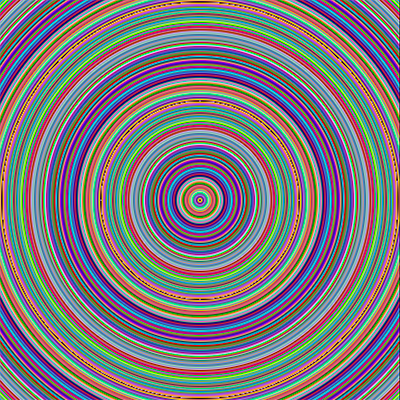

### Variables

Incantations may contain "variables", which are demarcated by ```{varname}```
within the incantation. For example:

```
a{var1}
```

Represents a Constant codon whose value is whatever the value of ```var1```
is set to. Variables are set at execution time and fixed throughout the run.

# Running NausiCAä

## Prerequisites

* JVM 11: You should be able to obtain this for your OS somehow, or it might already
be installed. It seems to be a bit of a mess right now. Should be forward-compatible
with, say, JVM 18, but haven't tested that. If you run ``java -version`` and it looks
like something 11.x or greater, then you're probably good.
* JavaFX 11: Also a mess. Hopefully you can figure it out. I've only tested on macOS.
It might "just work". Oddly, seems to be getting more difficult to package with each
successive version.

## From Binary

The link in the most recent stable binary release contains a zipfile with the
entire release.

* v1.0: https://github.com/jkwhite/nausicaa/releases/tag/v1.0

Depending on the host OS, this can then be executed however your OS normally executes
programs. Typically that would be through one of the batch files in the `bin`
dir. This is clearly non-ideal, but works non-ideally. That means running either

```
Nausicaa-1.0/bin/nausicaa
```

or

```
Nausicaa-1.0/bin/nausicaa.bat
```

depending on your OS.


## From Source

NausiCAä uses Gradle for builds. It's currently difficult to build from source
because it has some dependencies on libraries that were never published to
maven central or any other well-known shared location. That's because it
previously used a build system called 'mu' which had its own publishing system.

So, if you want to build from source, the easist way is probably to follow
these steps:

1. Download and unpack the binary as described above
2. Edit the `build.gradle` file and add the location of the unpacked binary's
`lib` directory to the `repositories` `flatDir` section.
3. At this point, gradle should work as usual.

I realize this obviously isn't completely from source, but it's the only way
to make it work until I can get the dependencies properly into
the shared gradle/maven ecosystem.


# Using the NausiCAä GUI

## Configuration File

Note that, beside whatever CAs or images you choose to export, NausiCAä will
write to one file in your home directory called `.nausicaa`. This is a JSON
file that contains all configuration options you've set through the GUI.

## Main Window

By default, the main window shows 9 subwindows arranged in a 3x3 grid. The
center window displays the "current" automata. Arranged around the center
window are 8 random variations on the current automata, generated by "mutating"
the current automata's incantation or other attributes.

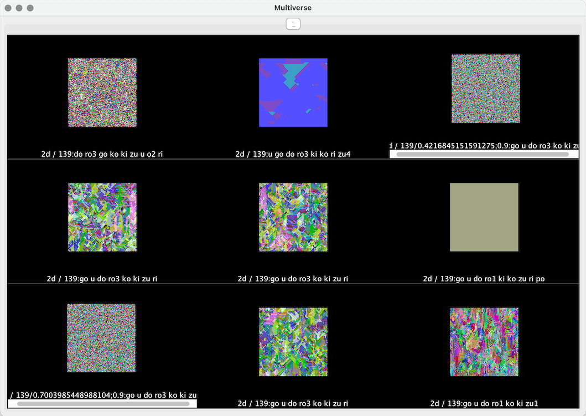

By clicking on any of 8 surrounding subwindows, you "select" that mutation
as the new "current" mutation. It becomes the new center subwindow and 8
subsequent mutations are generated based on it. If instead you click the
center subwindow, then it remains the current mutation and 8 different random
mutations are generated.

This allows you to arrive at interesting automata by making repeated slight
modifications to automata.

The command ``Window | Hide mutations (⌘Y)`` allows you to hide (or show)
mutations so you can focus on the current automata. Continuing the above
example, after hiding mutations the main window will appear as:

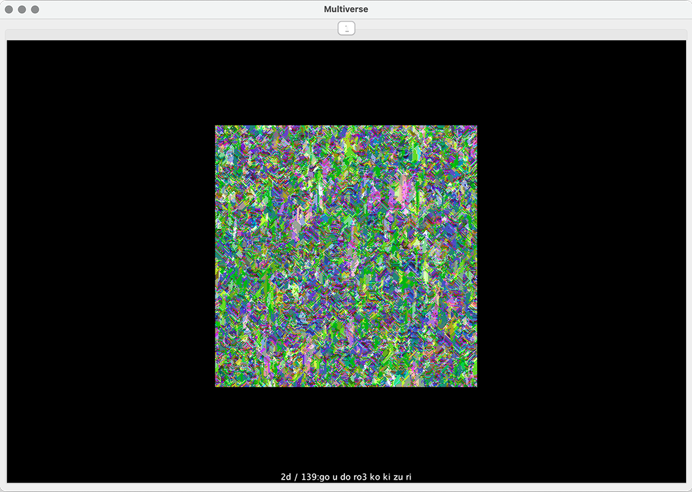

## Info Window

The info window at ``Automata | Info (⌘I)`` displays a summary of the
current automata.

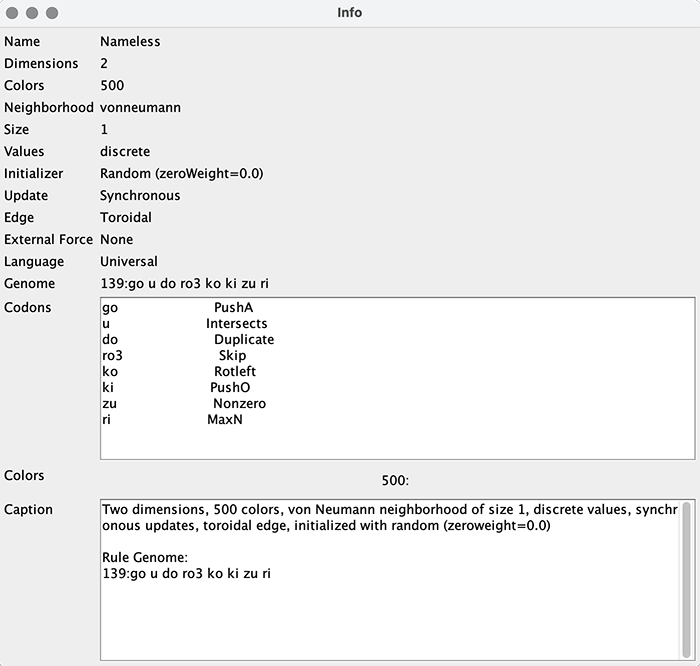

Most of the displayed values should be self-explanatory. The most useful
display here is the "Codons" value. This value shows an expanded list of
the automata's incantation as it will be executed in-order from top to
bottom. In the above example, this should be interpreted as

```
Syll  Codon      Meaning
go    PushA      Push all cells onto the stack
u     Intersects Pop top 3 values and push 1/0 if/not middle value is between
do    Duplicate  Duplicate top values
ro3   Skip       Pop and discard top 3 values
ko    Rotleft    Bitwise-rotate using top 2 values, i.e. v1<<v2
ki    PushO      Push all surrounding cells
zu    Nonzero    Remove all 0 values from the stack
ri    MaxN       Push the greatest value of the top N stack values
```

It should be noted that this particular incantation was generated at random,
so doesn't have any specific meaning.

## Basic Parameters Window

Basic automata parameters are set with ``Automata | Configure parameters ... (⌘ K)``.
This can be used to set lattice *width*, *height*, and *depth* (if appropriate).
It can also set *prelude*, which is the number of iterations to evaluate
before rendering the initial visualization.

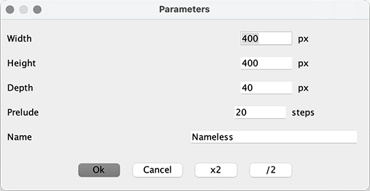

Depth is interpreted differently depending on the dimensionality of the
automaton and the configured rendering mode.

For 2D automata, depth is used to retain some number of prior lattice
states. Then, if the main window is in 2D view mode, the current and
all prior states of each lattice cell are projected into a single pixel
in the visualization based on the rendering mode (see Rendering Modes
for details). If instead the main window is in 3D mode, then the current and
all prior states are rendered as a 3D rectangle, with current state at
the "top" of the Y (vertical) axis.

For 3D automata, depth is simply the 3rd dimension of the automata's lattice
space, rather than a collection of prior states as with 2D automata. Other
than that difference, view rendering follows the same process as with 2D
automata.

This window also allows you to set a "name" for the automaton. This is arbitrary
descriptive text and does not in any way affect computation or visualization.

## Rule Editor Window

The rule editor window at ``Window | Show rule editor (⌘G)`` displays
(or hides) the current automata's rules, as described in [Rules](#rules).

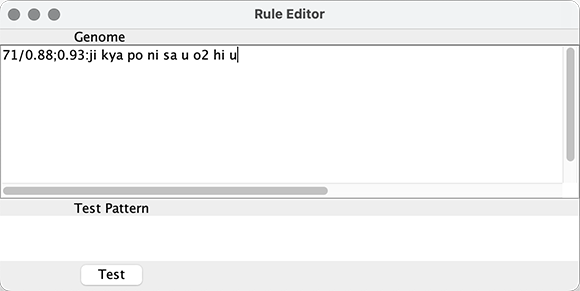

To commit to using the edited rule, **position the cursor at the end of the
rule** and hit enter. To discard any changes, simply close the window.

**Important:** Be sure the cursor is positioned at the end of
the rule(s) before hitting *enter* to set the new rules, otherwise rule(s)
will be truncated (this window will be improved in a future release).

The ``Test`` area allows you to enter a pattern to see how the edited rule
will interpret it. Enter each cell value in the pattern space row-by-row, with
each value separated by a space. For example, for a discrete two-value
automata with a Von Neumann neighborhood of size 1, you might specify

```
0 1 0 1 1 1 1 0 0
```

## Palette Editor Window

The palette editor window at ``Window | Show palette editor`` displays
(or hides) the current automata's color palette. Click on a color to
change it.

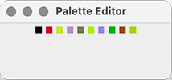

**Implementation note:** The palette editor should only be used with a
small numbers of colors; there is no hard limit, but selecting invididual
colors by hand only really scales when there are less than, say, 100 colors.
For larger palettes, use one of the commands under the ``Palette`` menu
instead, which are designed to deal with huge palettes.

## File Menu

### New

Creates a new automata. The current automata is discarded.

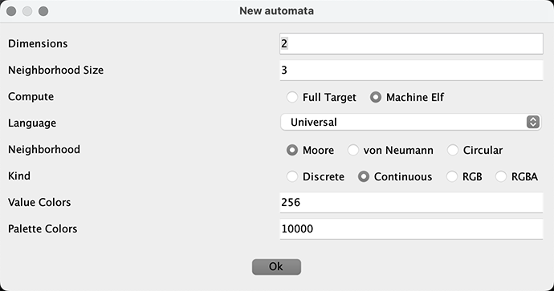

* Dimensions: 1, 2, or 3 depending on number of lattice dimensions (i.e.,
a line, a square, or a cube).
* Neighborhood Size: Size of surrounding lattice cells that are considered
"neighbors" and therefore available during incantation computation.
* Compute: "Machine Elf" allows rules to be expressed in the Machine Elvish
language. "Full Target" is the traditional indexed method of referencing
automata rules.
* Language: Defines the syllabary for incantations. "Universal" contains
all known syllables. "Classic" only contains those syllables necessary
to build automata that can be defined by the "Full Target" compute type
(e.g., no coordinates, randomness, etc). "Circular" is universal and also
includes some compound syllables for building lattices with circular
characteristics. "Symmetric2d" should not be used at this time.
* Neighborhood: Type of neighborhood. See [Neighborhoods](#neighborhoods)
for details.
* Kind: Type of lattice to use. See [Value Kinds](#value-kinds) for details.
* Value Colors: Number of allowable values for the lattice. For discrete
automata, this is the color count, i.e. a value of `2` corresponds to an
automata that creates lattices with values in [0,1]. For continuous
automata, this is the upper bound for the value range. For RGB and RGBA
automata, this is fixed at 16777216.
* Palette Colors: For Continuous automata, number of colors in the palette.
Has no effect on other kinds of automata.


## Automata Menu

The Automata menu provides options for configuring the current automaton.

### Initial State

*Initial state* is the starting values of the lattice at time step 0, before
any updates are applied. There are several different modes of setting initial
state, described below.

#### Random Initial State

This mode sets each value of the lattice to a random value. Options:

* Zero weight: Value between 0 (completely random) and 1 (all values set to 0)
that determines how often a lattice value is set to 0 rather than a random
value. Can be used to create "sparse" lattices. For example, a value of `0.5`
causes approximately half of all lattice values to be set to 0 rather than
a random value.

#### Fixed Initial State

This mode sets a single block of lattice values to a specified value. Options:

* Color: Value to set
* X, Y, Z: Lattice coordinate to set. Use `-1` to indicate center.
* Size: Size of block to set values, with `1` indicating a single coordinate.

#### Word Initial State

This mode should not be used at present; it needs to be rewritten or removed.

#### Image Initial State

This mode sets lattice values from an image. Options:

* Image: PNG file to use
* Method: "Center" centers the image on the lattice. "Tile" repeats the image
across the lattice. "None" simply places the image in the upper-left corner.
* Scale: If set, the image will be scaled to the lattice dimensions.

#### Gaussian Initial State

This mode creates one or more points and sets lattice values around them in
a Gaussian distribution. Options:

* Zero weight: Similar to Random Initial State, determines how often a value
is set to `0` rather than a random value.
* Max points: Maximum number of points to create distributions around.
* Max radius: Maximum size of distributions around points.
* Density: Real-valued coefficient that determines number of values to set
within each point. For example, 0.5 would cut the number of values in half,
while 2 would double it.

#### Clustered Gaussian Initial State

Similar to Gaussian Initial State, this mode creates one or more points and
sets lattice values around them in a Gaussian distribution. However, it also
"skews" values created around each point such that each point is "clustered"
around part of the automata's value range. For example, if the automata
has 100 value colors and there are 3 points, then point 1 would have values
0-33, point 2 would have values 34-66, and point 3 would have values 67-99.

* Zero weight: Similar to Random Initial State, determines how often a value
is set to `0` rather than a random value.
* Max points: Maximum number of points to create distributions around.
* Max radius: Maximum size of distributions around points.
* Density: Real-valued coefficient that determines number of values to set
within each point. For example, 0.5 would cut the number of values in half,
while 2 would double it.
* Skew: Currently unused. Might be used in the future to provide some sort
of overlap so that value ranges are not entirely exclusive to each point.

#### CA Initial State

This mode sets the initial state based on a lattice produced by another
automata. The automata must be compatible with the current automata in
terms of value space (i.e., number of colors). The purpose of this mode
is to allow automata to be "chained" together. This is currently only
supported for discrete (indexed) automata, not continuous (real) automata.
Options:

* Automata: Automata `.ca` file to use
* Iterations: Number of iterations to run to produce the lattice that will
be used to set the initial state

#### Custom Initial State

This mode allows the initial state to be defined using a script written in the
Groovy language. The following pre-populated variables are available:

* a: An instance of an org.excelsi.nausicaa.ca.Archetype for the automata
* i: An instance of an org.excelsi.nausicaa.ca.Painter
* r: An instance of a java.util.Random

Lattice values can be set using methods on `i`.

### Update Mode

*Update mode* determines how and when values in the lattice are updated.

* Synchronous: All cell updates occur as a single, atomic operation.
* Asynchronous: Cell updates occur at the specified probability in range (0.0-1.0),
with 1.0 being equivalent to Synchronous update mode.
* Local Asynchronous: Like Asynchronous mode, except cell update probability
is determined by inverse distance from the center of the lattice.
* Energy Asynchronous: Like Asynchronous mode, except cell update probability
is determined by the color value of the current cell. Cells whose values are
closer to the maximum possible value are more likely to update.
* Variable: Similar to Energy Asynchronous, but uses values drawn from adjacent
planes instead of current cell value. Requires a 2D automata with depth > 1.

### Edge Mode

* Toroidal: The edge "wraps around", that is, the top/bottom and left/right
edges are considered to be contiguous to each other.
* Zero: All cells outside the visible area are considered to be 0.
* Constant: All cells outside the visible area are considered to be the
specified value.

### External Force

* None: Lattice cell values are determined solely by the update rule.
* Random: Randomly-valued "snow" is introduced to the lattice at the specified
frequency.

### Other Options

* Reroll: Sets a new seed value for this automata's random source and resets
the lattice.
* Configure parameters: Displays a dialog for setting lattice width, height,
depth, and prelude (number of iterations to run before displaying initial lattice)
* Variables: Displays a dialog for setting variables, if any have been defined.
See [Variables](#variables) for details about how to use variables.
* Translate to Universal: If the automata's language (as chosen at creation)
was not `Universal`, then this translates the automata's genome into the universal
language. It's not very useful, really, and might be removed in the future.

## Animation Menu

Animation for both 2D and 3D automata can be started/stopped with the
``Animation | Animate (⌘A)`` command. Animation iterates through successive
evaluations of the automaton's rule. (1D automata cannot be animated because
successive rule evaluations are simply displayed on the vertical axis.)

The amount of resources consumed by animation is configurable with the
``Animation | Configure animation ...`` command. At present, only the
``Compute cores`` option is used; ``Render cores`` is unused but may be used
in the future.

"Compute cores" is the number of concurrent threads used to compute successive
lattice values. It should be set somewhere between 1 and the number of cores
on your machine, depending on how much CPU you want NausiCAä to be able to
consume.

### Generate to disk

The ``Animation | Generate to disk (⌘D)`` command can write individual
animation frames to a directory as separate PNG files, or it can generate
an entire animation as a single animated GIF file.

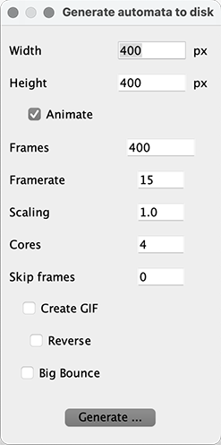
* Width & Height: Override currently-configured automata size values. (TODO:
add similar for depth.)
* Animate: If checked, each individual frame, or an animated GIF, will be
written to disk. Otherwise only the final frame will be written.
* Framerate: Framerate for GIFs. Has no effect when individual frames
are written.
* Scaling: Scale factor for frames, e.g., setting this to 0.5 will downscale
generated frames by 50%.
* Cores: Number of compute threads to use in animation pipeline.
* Skip frames: Skip over some number of frames during generation. The frames
are still computed, but are not written to disk. This can be useful to reduce
the size of generated data for slowly-evolving automata. Affects both frame
generation and animated GIFs.
* Create GIF: If checked, output will be a single animated GIF file.
* Reverse: Generate frames in reverse (i.e., if generating 100 frames, then
frame 0 will be numbered 99, 1 will be 98, etc.).
* Big Bounce: Generate frames from the middle out. This results in a
wrap-around kind of effect.

(Note: for the tasks of GIF post-processing and making movies from frames,
the author recommends the excellent ``gifsicle`` and ``ffmpeg``. Of course
you can use whatever programs work for you.)

## Palette Menu

The Palette menu provides a number of pre-configured palette options, as well
as an option for defining a custom palette, and an option for creating a
palette from a source image.

### Using a custom palette

The ``Palette | Custom Spectrum ...`` command creates a random palette based
on the configured options. Note that the exact colors used in the spectrum
change on successive uses of this command. The spectrum is constructed around
some number of "anchor colors". Colors between each anchor color and its
neighbors are then linearly interpolated to create a smooth transition.
Options:

* Number of colors: Number of anchor colors to use
* Density: Currently unused
* Black zero: Always use black for lattice value `0`
* Invisible %: Set this percentage of anchor colors to RGBA value `(0,0,0,0)`
* Wrap: Make the spectrum "wrap-around". That is, the left-most anchor color
is equal to the right-most anchor color.

## Mutate Menu

**Making Mutations**
Mutations can be applied in several ways:
* By selecting one of the randomly-generated mutations in the main window
(shown with ⌘Y).
* By using the ``Mutations`` menu to specifically select a type of
incantation mutation.
* By enabling other kinds of mutations like *Weight variations*,
*Hue variations*, *Parameter variations*, and *Initializer variations*,
which are found under the ``Mutations`` menu. When enabled, these
mutations will also show up as randomly-generated mutations in the main
window.

### Sequences, Stages, and Mutations

Recall that a [Sequence](#sequences) is a series of Stages composed of Rules
which execute one after the other, then repeat from the beginning.

Stages can be added or removed using the ``Mutate | Add rule stage`` and
``Mutate | Remove active rule stage`` commands. By default, the
*active rule stage* becomes the most-recently added stage. This may be
configured under ``Mutate | Parameters...`` (*Mutation stage*), with the
first stage being numbered 0. If the *mutation stage* is set to -1,
then all stages will be subject to mutation.

## Render Menu

### RGB compute mode

When an automata has been defined as either of type RGB or RGBA, this option
can be used to determine the way lattice cell values are interpreted during
next-value computation. For indexed (discrete) or real (continuous) automatons,
this option doesn't make sense, though it can still be toggled.

* Combined: The incantation is computed on the lattice cell value. Mapping
the value to a palette color occurs elsewhere.
* By channel: Each lattice cell is presumed to hold an RGBA value. Each channel
(R, G, B, and optionally A) is extracted from the value and the incantation is
computed for each channel, then all values are recombined into the new RGBA
lattice cell value.

### Meta compute mode

TBD.

### Composition Mode

Depending on how composition is configured, the same automata may be visualized
in different ways. For example, here is the same 200x200x40 2D automata
with prelude 20 rendered first with ``Render | Composition mode | Nearest only``
and then as ``Render | Composition mode | Weighted average``:

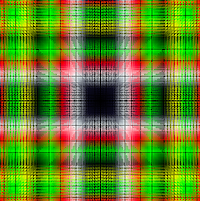 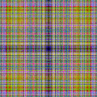

These and other *composition modes* affect how the "depth" dimension is rendered
to the two-dimensional visualization. (TODO: Not all composition modes are
currented supported at all dimensions.)

* Nearest only: Use only the first non-zero cell value in range (depth-1,0).
* Farthest only: Use only the first non-zero cell value in range (0,depth-1).
* Weighted average: Use an average of all cell values, weighting those with higher
depth (i.e., more recent iterations) higher.
* Weighted average reverse: Use an average of all cell values, weighting those with
lower depth (i.e., less recent iterations) higher.
* Average: Use an average of all cell values, weighed equally.
* Channel: Depth must be set to 3 or 4. With depth 3, renders packed RGB
values using depths (0,1,2). With depth 4, renders packed RGBA values using
depths (0,1,2,3).
* Multiply: Uses a value computed from cells at all depths multiplied together,
normalized between (0,255).
* Difference: Uses a value computed from the total difference between each
successive cell value at all depths, normalized by depth.
* True Nearest: Uses only the cell value at the highest depth.

## Functions Menu

NausiCAä is packaged with a number of custom functions written in the
Groovy language. These functions operate as a kind of scripting language.
Brief descriptions of the currently packaged functions follows.

## View Menu

Most options on the View menu should be self-evident. The one which
requires some explanation is `Toggle animations`. This option only applies
to 3D render mode, and toggles whether or not the rendered lattice is
spun about or shown from a static angle.

## Experimental Menu

This menu is a repository for incomplete features.

## Window Menu

This menu controls which windows are displayed and their display modes.

* Show/hide mutations: Controls whether or not mutations are displayed in
the [Main Window](#main-window). Refer to that section for more information
about how to use mutations.
* Show/hide palette editor: The palette editor can be used to modify
individual colors in the current palette. Note that this is only feasible
when the automata contains a small number of colors. When the colorspace
is large, it is more effective to modify the palette using one of the
options on the [Palette Menu](#palette-menu). See
[Palette Editor Window](#palette-editor-window) for more information on
using the palette editor.
* Show/hide rule editor: The rule editor can be used to modify all aspects
of the automata's generation process, including the sequence, weights,
and incantations. See [Rule Editor Window](#rule-editor-window) for
more information.
* Show/hide language editor: The author needs to refamiliarize himself
with this part of NausiCAä before writing documentation on it.
* Toggle console: Toggles the interactive Groovy console window.

## Cheat Sheet: A Few Important Commands

Here is a brief list of a few of the more often-used GUI commands.

**File menu: Handling automata files**
* ⌘N - Create a new automata
* ⌘S - Save current automata
* ⌘O - Open a previously-saved automata

**Automata menu: Basic automata parameters**
* ⌘K - Set lattice width, height, and depth (if appropriate).
Also sets prelude, which is the number of iterations to go
through before rendering the initial visualization.
* ⌘I - Display an informational window describing the current automata.

**Automata menu: Setting initial lattice state**
* ⌘B - Use a random initial state; the lattice is set to random
values within the value space weighted toward 0 based on the zero
weight as set between (0.0,1.0).
* ⌘F - Use a "fixed" initial state; the specified coordinate is
set to the specified value (or -1,-1,... for center) and all other
coordinates are set to 0.
* ⌘G - Gaussian initial state; one or more clusters of values are
created based on specified attributes.
* ⌘L - Clustered Gaussian initial state; similar to Gaussian initial
state, but values for each cluster are pulled from different value
ranges; i.e., with 2 clusters, one cluster may have value ranges
0-9 and the other may have value ranges 10-19.

**Animation menu: Animating 2D and 3D automata**
* ⌘A - Start/stop iteration animation.
* ⌘D - Write animation frames to disk so they can be used within
a video editor, or write an animated GIF to disk.

**Render menu: Configuring visualization rendering**
* ⌘⇧V - Toggle between 2D and 3D rendering modes

**View menu: Viewing visualizations**
* ⌘= - Zoom in
* ⌘- - Zoom out
* ⌘0 - Actual size

**Window menu: Automata windows**
* ⌘Y - Show/hide mutations in main window
* ⌘G - Show/hide incantation editor window

# Using NausiCAä as a library

NausiCAä can also be used as a Java library completely independent from the GUI.
All relevant classes are under the `org.excelsi.nausicaa.ca` package. 

# Reference Guide

## Codon Catalog

### a (Constant)

Syntax: `a*Value*`

Pushes *Value* onto the stack, where *Value* is any integer or real value.
**Note that discrete automata may only use integer values.**

### ba (Bitwise Left Rotate)

Syntax: `ba`

Pushes the bitwise-left-rotated value of the top stack value rotated by the next
top stack value. **Note that this is only supported for discrete automata.
For continuous automata, the top stack value will simply be pushed back on the stack.**

### be (Greater Than)

Syntax: `be`

Pushes `1` if `v1>v2`, else `0`. where v1 and v2 are the top two stack values.

### bo (Negate)

Syntax: `bo`

Pushes the negation of the top stack value. For example, if the stack is
[5 3 1], the new stack will be [5 3 -1].

### bu (Less Than)

Syntax: `bu`

Pushes `1` if `v1<v2`, else `0`. where v1 and v2 are the top two stack values.

### chi (Min)

Syntax: `chi*Value*`

Pushes the minimum value of the top *Value* values onto the stack. *Value*
is optional; if not specified, all values on the stack are considered
(i.e., the entire stack).

### cho (Bandpass)

Syntax: `cho`

Uses the top three stack values as `up`, `low`, and `mid` to determine if
`mid` falls between `low` and `up`, inclusive. If true, pushes `mid`, otherwise
pushes `0`.

### da (Data Block)

Syntax: `da*Data*`

TBD.

### de (Hyperpolic Tangent)

Syntax: `de`

Pushes the hyperbolic tangent of the top stack value. **This codon only
works with continuous automata. For discrete automata, it does nothing.**

### do (Duplicate)

Syntax: `do`

Peeks at the top stack value and pushes it again. For example, if the
stack is `1 2 3 4`, then the result is `1 2 3 4 4`.

### e (Avg N)

Syntax: `e`

Pushes the average of the last N values onto the stack, where N is the top
value on the stack, and not included in the average. For example, if the stack
consists of `4 2 1 3`, then N is 3 and `(4+2+1)/3` will be pushed.

### ga (Halt)

Syntax: `ga`

Pushes Self and stops evaluation.

### ge (Push All Rotate)

Syntax: `ge`

Pushes all Neighbor cell values including Self onto the stack, "rotated"
by the top stack value. For example, if the top value is 4, pushes cells
beginning at index 4.

### gi (Avg)

Syntax: `gi*Value*`

Pushes the average of the top *Value* values onto the stack. If *Value* is not
specified, then the entire stack is considered.

### go (Push All)

Syntax: `go`

Pushes all Neighbor cell values including Self onto the stack. Self is
always pushed last.

### gu (Count **DEPRECATED - BROKEN - Use `pu` instead**)

Syntax: `gu`

Counts the number of values in the pattern that are equal to the top stack
value and pushes the count. **Note: Does not actually do this, use `pu` instead.**

### ha (Exclamatory)

Syntax: `ha`

Pushes `N!`, where N is determined by the top stack value. **Note 1: This
can be quite expensive to compute for large values. There are no guardrails
and no overflow check.**
**Note 2: For continuous automata, this does nothing.**

### he (Convolve)

Syntax: `he`

Pushes a value computed by summing and multiplying parts of the pattern and
the stack.

### hi (Histogram)

Syntax: `hi`

Computes a histogram of all values in Pattern and pushes it to the stack
in size order. For example, if the pattern is `1 5 7 2 5 7 7 7 1`, then
it will push `1 2 2 4`.

### ho (Divide)

Syntax: `ho`

Pushes the division of the top two values onto the stack. In the case of division
by zero, simply pushes the top value back.

### hu (Supersymmetry)

Syntax: `hu`

Pushes the value that is "opposite" to the top stack value and the middle value,
based on the number of colors in the automata. For example, if the automata
has 4 colors, then color 1 is opposite color 2, and color 0 is opposite color 3.

### i (Pow)

Syntax: `i`

Pushes v1^v2^ onto the stack, where v1 and v2 are popped off the stack.
**Note that for discrete automata, if v2 is less than 0 it will be replaced
by 0.**

### ja (Jump)

Syntax: `ja`

"Jumps" forward or backward a number of codons determined by the top stack value.
This can allow evaluations to loop (by jumping backward), or to skip (by jumping
forward). There is a maximum number of codon evaluations allowed per cell, so
infinite loops are impossible. This is currently set to 1000. In such cases, the
evaluation is forcibly terminated, with the evaluation result being whatever value
was at the top when the loop was broken.

### ji (Skip N)

Syntax: `ji`

Pops N values off the stack, where N is determined by the top stack value (which
is popped before the skip and thus not counted as part of the skip).

### jo (Min N)

Syntax: `jo`

Pushes the minimum of the last N values onto the stack, where N is the top
value on the stack, and not included in the minimum. For example, if the stack
consists of `4 2 1 3`, then N is 3 and `1` will be pushed.

### jya (Relative Coordinate)

Syntax: `jya[0|1|2]`

For continuous automata, pushes either the relative `x`, `y`, or `z` cell
coordinate, depending on which numeric argument is used. If no numeric
argument is specified, pushes all available coordinates, depending on the
dimensionality of the automata. Relative coordinates range from -1.0 to 1.0,
with 0.0 at the center of the lattice. For discrete automata, functions
the same as `kya`.

### ka (Bitwise Or)

Syntax: `ka`

Pushes the bitwise-or value of the top two stack values. **Note that this is
only supported for discrete automata. For continuous automata, the top stack value
will simply be pushed back on the stack.**

### ke (Greater)

Syntax: `ke`

Pushes 1 or 0, depending on whether `v1>=v2`, where v1 and v2 are the top two
stack values.

### ki (Push Surrounding)

Syntax: `ki`

Pushes all surrounding cells values onto the stack. The definition of
"surrounding" depends on two factors: (1) Neighborhood type (Moore, von Neumann,
or Circular), and (2) Neighborhood size.

### ko (Bitwise Rotate Left)

Syntax: `ko`

Pushes the bitwise-left-rotated value of the top stack value rotated by the next
top stack value. **Note that this is only supported for discrete automata.
For continuous automata, the top stack value will simply be pushed back on the stack.**

### ku (Bitwise Rotate Right)

Syntax: `ku`

Pushes the bitwise-right-rotated value of the top stack value rotated by the next
top stack value. **Note that this is only supported for discrete automata.
For continuous automata, the top stack value will simply be pushed back on the stack.**

### kya (Coordinate)

Syntax: `kya[0|1|2]`

Pushes either the `x`, `y`, or `z` cell coordinate, depending on which numeric
argument is used. If no numeric argument is specified, pushes all available
coordinates, depending on the dimensionality of the automata.

### ma (Equals)

Syntax: `ma`

Pushes 1 or 0, depending on whether `v1=v2`, where v1 and v2 are the top two
stack values.

### me (Sum N)

Syntax: `me`

Pushes the sum of the top N values onto the stack, where N is the top
value on the stack, and not included in the sum. For example, if the stack
consists of `4 2 1 3`, then N is 3 and `4+2+1` will be pushed.

### mi (Sum)

Syntax: `mi*Value*`

Pushes the sum of the top *Value* values onto the stack. *Value* is optional;
if not specified, all values on the stack are summed (i.e., the entire stack).

### mo (Modulo)

Syntax: `mo`

Pushes `v1%v2`, where v1 and v2 are the top two stack values. If v2 is 0,
simply pushes v1.

### mu (Multiply)

Syntax: `mu*Value*`

Pushes the product of the top *Value* values onto the stack. *Value* is optional;
if not specified, all values on the stack are multiplied (i.e., the entire stack).

### mya (Mandelbulb)

Syntax: `mya`

Pushes the Mandelbulb Set value using the top five values on the stack, defined
in order as `scl` (scaling factor), `z` (iterations), `x`, and `y`, and `z`
(coordinates). For safety, iterations is capped at 100. While this codon is
intended to be used with 3D automata, it can be used with any dimensionality
since the coordinate values are popped from the stack. Note that this produces
a *discrete approximation* of the fractal, as lattices are discrete in nature.

### na (Lesser)

Syntax: `na`

Pushes 1 or 0, depending on whether `v1<=v2`, where v1 and v2 are the top two
stack values.

### ne (Not Equals)

Syntax: `ne`

Pushes 1 or 0, depending on whether `v1!=v2`, where v1 and v2 are the top two
stack values.

### ni (Square Root)

Syntax: `ni`

Pushes the square root of the absolute value of the top of the stack.

### no (Push N)

Syntax: `no`

Pushes the Nth pattern value, where N is determined by the top value on the
stack. The pattern contains both neighbor cells and self.

### nu (Cube Root)

Syntax: `nu`

Pushes the cube root of the top of the stack.

### nya (Mandelbrot)

Syntax: `nya`

Pushes the Mandelbrot Set value using the top four values on the stack, defined
in order as `scl` (scaling factor), `z` (iterations), `x`, and `y` (coordinates).
For safety, iterations is capped at 100. While this codon is
intended to be used with 2D automata, it can be used with any dimensionality
since the coordinate values are popped from the stack. Note that this produces
a *discrete approximation* of the fractal, as lattices are discrete in nature.
 
### o (Push Neighbor)

Syntax: `o*Neighbor*`

Pushes *Neighbor* onto the stack, where *Neighbor* is the index of any cell
in the set of neighboring cells. Index values wrap around, so attempts to push
indeces greater than the size of the set of neighbors are "safe".

### pa (Push Cardinal)

Syntax: `pa`

Pushes all cells lying in cardinal directions from the main cell.

### pe (Absolute Value)

Syntax: `pe`

Pushes the absolute value of the top stack value.

### pi (Filter)

Syntax: `pi*Value*`

**Bugged**

### po (Equals Array)

Syntax: `po*Value*`

If an entire array up to length *Value* is equivalent to a compared array,
returns 1, else 0.

### pu (Count - Fixed)

Syntax: `pu`

Counts the number of values in the pattern that are equal to the top stack
value and pushes the count.

### ra (If)

Syntax: `ra`

Pops the top three stack values as *cond*, *tr*, and *fl* (condition, true case,
and false case). If *cond* is non-zero, pushes *tr*, otherwise pushes *fl*.

### ri (Max N)

Syntax: `jo`

Pushes the maximum of the last N values onto the stack, where N is the top
value on the stack, and not included in the maximum. For example, if the stack
consists of `4 2 1 3`, then N is 3 and `4` will be pushed.

### re (Sine)

Syntax: `re`

Pushes the sine of the top stack value. **This codon only works with continuous
automata. For discrete automata, it does nothing.**

### ro (Skip)

Syntax: `ro*Value*`

Pops *Value* values off the stack.

### ru (Sigmoid)

Syntax: `ru`

Pushes the sigmoid of the top stack value. Specifically, 1/(1+e^-*v*^), where
*v* is the top stack value. **This codon only works with continuous automata.
For discrete automata, it does nothing.**

### sa (Stop)

Syntax: `sa`

The top of the stack is popped, and if 0 stops evaluation.

### se (Not)

Syntax: `se`

Pushes 1 if the top stack value is 0, otherwise pushes 0.

### shi (Position)

Syntax: `shi`

Pushes the current position (i.e., size) of the stack. For example,
if the stack is "5 3 3 1", then pushes 4.

### so (Not Intersects)

Syntax: `so`

Tests if `mid<low || mid>high`, where all three values are popped off the stack
in the order high, low, mid. Pushes 1 (true) or 0 (false).

### su (Subtract)

Syntax: `su`

Pushes `v1-v2`, where v1 and v2 are the top two stack values.

### ta (Max)

Syntax: `ta*Value*`

Pushes the maximum value of the top *Value* values onto the stack. *Value*
is optional; if not specified, all values on the stack are considered
(i.e., the entire stack).

### te (Time)

Syntax: `te`

Pushes the current iteration count, starting from 0. **Note that for animated
automata, this value will only be consistent over the duration of a single
animation execution. If the animation is stopped and started again, time will
reset to 0. For step animation, the value will always be 0.**

### to (Bitwise And)

Syntax: `to`

Pushes the bitwise-and value of the top two stack values. **Note that this is
only supported for discrete automata. For continuous automata, the top stack value
will simply be pushed back on the stack.**

### tsu (Bitwise Xor)

Syntax: `tsu`

Pushes the bitwise-xor value of the top two stack values. For continuous automata,
real values are converted bitwise to integers, then bitwise back to reals
after the xor operation.

### wa (Most)

Syntax: `wa*Value*`

Pushes the value that occurs the most of times in the pattern.

### wo (Least)

Syntax: `wo*Value*`

Pushes the value that occurs the least of times in the pattern.

### u (Intersects)

Syntax: `u`

Tests if `low<=mid<=high`, where all three values are popped off the stack.
Pushes 1 (true) or 0 (false).

### ya (Self)

Syntax: `ya`

Pushes the current cell value onto the stack.

### yo (Intersects Self)

Syntax: `yo`

Tests if `low<=mid<=high`, where all three values are popped off the stack.
Pushes `mid` if true, or 0 if false.

### yu (Fork)

Syntax: `yu*Value*`

Fork skips over a variable number of stack values based on a Neighbor value,
specified by index using the optional *Value*. If *Value* is not specified,
Self is used. This can also be used to effectively branch evaluation within
the incantation if used in tandem with Stop codons for each branch. Further
description TBD as this works in mysterious ways and I'm tired.

### za (Halt)

Syntax: `za`

Stops evaluation. The evaluation result is whatever value is currently the
top stack value.

### ze (Random)

Syntax: `ze`

Pushes a random value between 0 and N, where N is determined by the top stack
value. If N is negative, pushes a random negative value between 0 and N.
If N is 0, pushes 0.

### zu (Non-zero)

Syntax: `zu*Value*`

Filters all non-positive values from the stack for the top *Value* values.
If *Value* is not specified, the entire stack is considered.

Bug: This should probably not filter negative values, but alas.

## Example automata

### The Game of Life

Incantation:

```
ki mi a2 a3 u ki mi8 a3 ma ya ra
```

This is the classic Game of Life (Conway's Life) automata, which has
two colors and a Moore neighborhood of size 1.

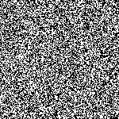

We can go through the incantation to understand how it operates.

```
ki	PushO
mi	Sum
a2	Constant
a3	Constant
u	Intersects
ki	PushO
mi8	Sumn
a3	Constant
ma	Equals
ya	PushS
ra	If
```

The first two syllables, `ki mi`, computes the total number
of "living" cells (value of 1) in the surrounding neighborhood,
excepting the self cell, which we'll call N. The next two syllables,
`a2 a3`, pushes those the two constant values 2 and 3 onto the stack as well.
So our stack now consists of `3 2 N`. Next, we apply an intersection
test with `u`, and push 1 or 0 depending on whether 2 <= N <= 3. (This
could also be done with a combination of conditionals and boolean logic
syllables.) The stack is now `[0|1]`, depending on the result of the test.

Next, we repeat the first two syllables with `ki mi8`, with
the '8' value being necessary to avoid consuming the entire stack. (This
could have alternately been done with a `du` (duplicate) syllable earlier
in the incantation, which would have been more efficient because it avoids
a second memory copy, but I'll leave that as an exercise for another time.)
The next two syllables, `a3 ma`, determine whether exactly 3 cells are alive
and push either 1 or 0. Next we push the self cell with `ya`.

The two branches of the conditional and the condition itself are now all set
up on the stack, and finally, with `ra` (If), we branch to the final result
based on the self cell value, in accordance with the Life rule. This isn't
a particularly efficient implementation, but it is straightforward. There are
other possible implementations that would be more efficient, like I mentioned
above with the `du` syllable, and we could also avoid computing the unused
branch by using `ja` (jump) and `za` (halt) syllables instead.

### Circular neighborhoods

Selected examples of 2D circular neighborhoods of sizes 3-5.

"Slippery"

``88/0.5;0.9:jya0 pa wo o30 ke ke ki``

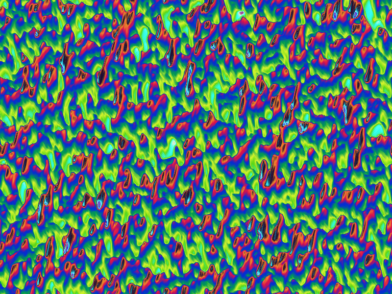

"Nitelite"

``0.62;1.21:bu ki kya0 bo pa wo ke ke ki o30 ta2``

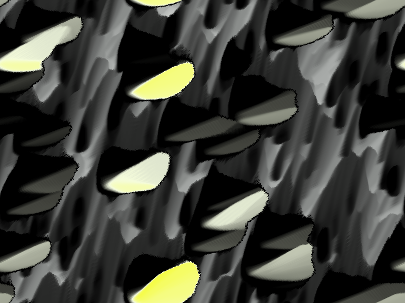

"Ringu"

``0.16;0.95:ma chi1 chi1 sa pa ko ma o16 o14 ru sa bo pa jya jya0 pe gi pe chi mi``

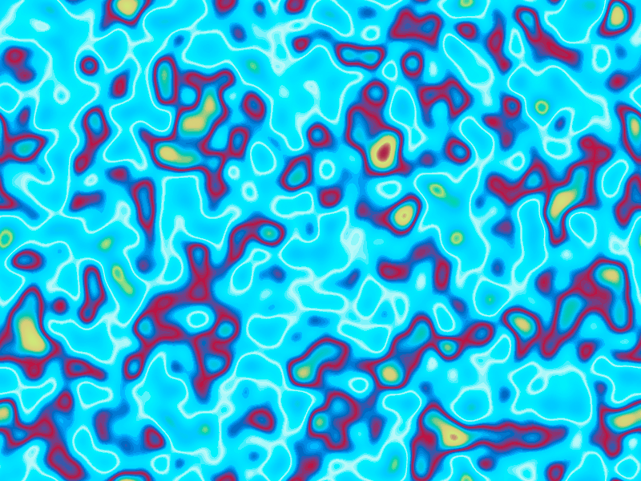

### Mandelbulb

Simple discrete mappings of the Mandelbulb fractal.

"Mandelbulb"

```98:kya0 kya1 kya2 a100 a100 mya```

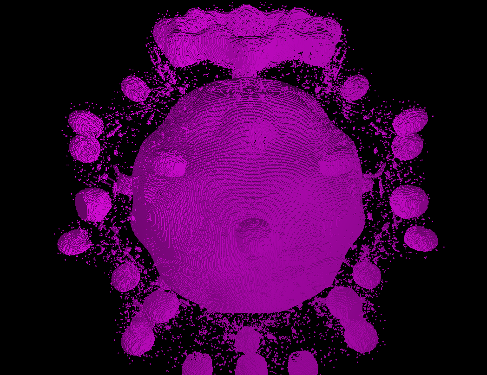

"Mandelbulb Animated"

```98:kya0 kya1 kya2 a10 a100 mya a-1000 a0 cho```

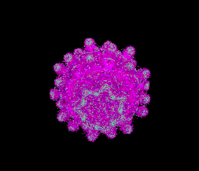


# Bugs

* This documentation is exceptionally incomplete.

* Building from source is probably not possible right now for anyone but me.
The problem is with dependencies on other projects that I own that are not on
github or in maven central etc. I need to get this worked out ASAP. I don't think
it will take a lot of engineering effort, it's mostly about mapping projects
hosted on a private SVN server for many years to something that works for the
public modern world.

* There are way too few sanity checks around reasonable limits. For example,
can you create a 3D automata in 1024^3 size? Maybe, maybe not. Or an automata
with 1MM palette colors? I honestly don't know. The only sanity check that
exists currently is with the Machine Elvish execution--where it's limited to
a certain number of evaluations per cell. This is a simplistic way of avoiding
infinite loops. So it's not possible to consume infinite processing time,
but it is possible to (try to) consume infinite memory.

* Speaking of limits, the JavaFX 3D renderer dies above a few hundred thousand
points. The renderer uses an algorithm to combine cells into larger blocks to
minimize the vertex and face counts, and this helps somewhat, but there's a
lot more that can be done.

* Updates in the GUI that fail get reported through the console logger rather than
proprer GUI reporting.

* 3D mode is quite brittle. It works fine at low limits, but pretty much anything
can set it off. I am looking at alternatives to JavaFX screengraphs.

+++ATH0
